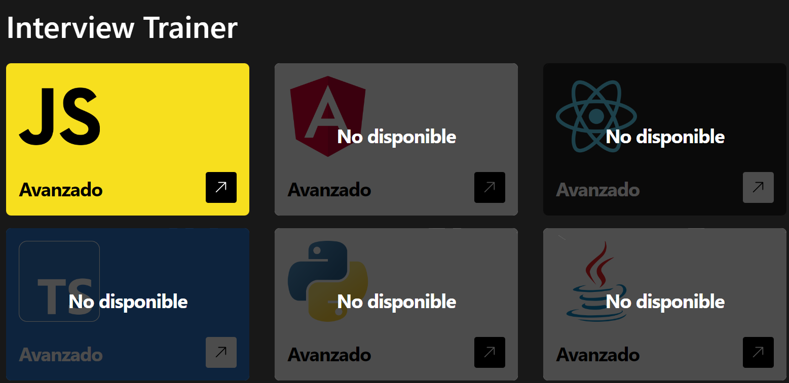

# Angular Quiz Interview

## Tabla de Contenidos

- [Angular Quiz Interview](#angular-quiz-interview)
  - [Tabla de Contenidos](#tabla-de-contenidos)
  - [Preview](#preview)
    - [Screenshot](#screenshot)
  - [Proyecto](#proyecto)
    - [Links](#links)
  - [Proceso](#proceso)
    - [Construido con:](#construido-con)
    - [Recursos Utilizados](#recursos-utilizados)
  - [Autores](#autores)
    - [OpenBootcamp Community](#openbootcamp-community)

## Preview

### Screenshot

## Proyecto

Este proyecto fue realizado con la participación de los integrantes de OpenBootcamp, y es parte de una dinámica llamada "OpenWeekapps"

### Links

- Repositorio: [Solution](https://github.com/Open-Bootcamp/angular-quiz-interview)
- Live Site URL: [Live App](https://angular-quiz-interview.netlify.app/register)

## Proceso

### Construido con:

- Mobile-first
- Diseño Responsivo
- Flexbox
- Angular
- TypeScript
- Tailwind
- Prismjs

### Recursos Utilizados

- [Angular Docs](https://angular.io/docs)
- [TypeScript Docs](https://www.typescriptlang.org/docs/)
- [Tailwind Docs](https://tailwindcss.com/docs/)
- [prismjs Docs](https://prismjs.com/docs/)
- [Cloudinary Docs](https://cloudinary.com/documentation)
- [MDN Web Docs](https://developer.mozilla.org/es/docs/Web)

## Autores

### OpenBootcamp Community

- GitHub - [@YhonaPeguero](https://github.com/YhonaPeguero)
- GitHub - [@LeandroMarcelo](https://github.com/Leandro-Marcelo)
- GitHub - [@TEO](https://github.com/teoisnotdead)